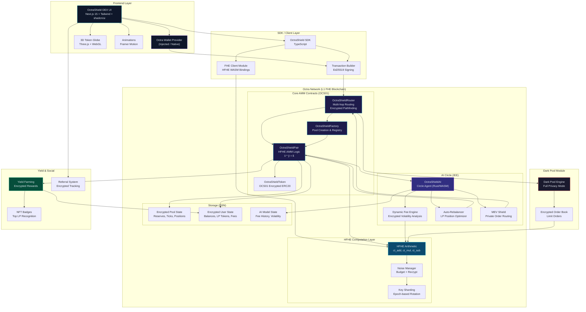
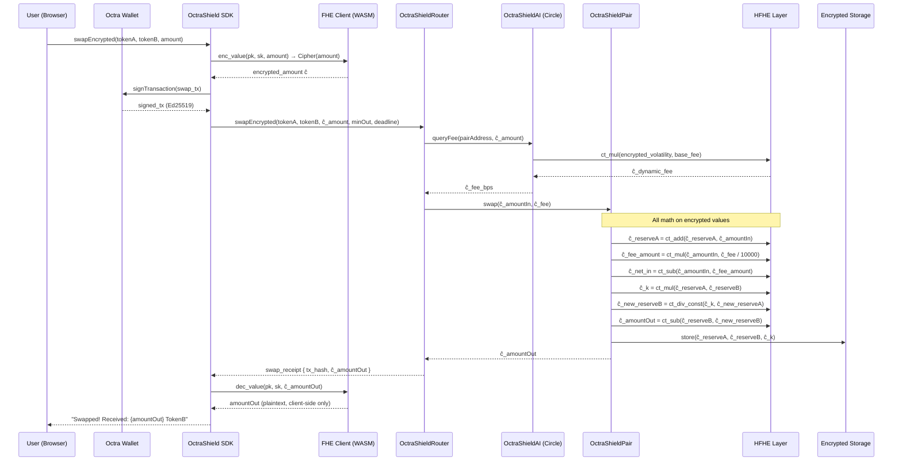
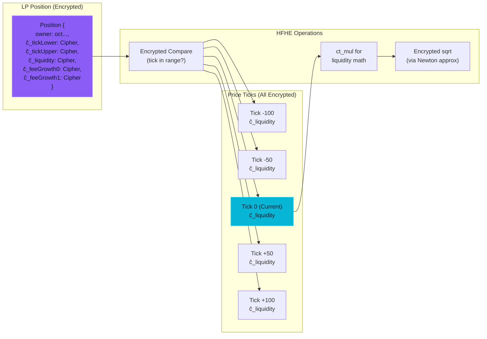
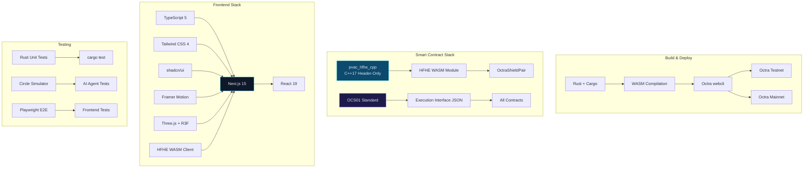

# OctraShield DEX — Phase 0: Architecture, Research & Planning

## Executive Summary

**OctraShield DEX** (codename: **ShieldSwap**) is the first fully homomorphic encrypted AMM/DEX built natively on Octra Network. It combines a hybrid Constant Product + Concentrated Liquidity model (inspired by Uniswap V3) with Octra's HFHE cryptosystem, making every swap, LP position, fee accrual, and reserve balance completely private — even from validators.

---

## 1. Research Findings — Octra Network Deep Dive

### 1.1 Core Technology Stack

| Component | Details |
|---|---|
| **Blockchain** | Octra Network — FHE-native Layer 1 |
| **Consensus** | Hybrid ABFT + Proof-of-Useful-Work (PoUW) |
| **FHE System** | HFHE (Hypergraph Fully Homomorphic Encryption) — proprietary, built in-house |
| **Prime Field** | Fp where p = 2^127 - 1 (Mersenne prime) |
| **Execution** | Circles (Isolated Execution Environments) — C++/Rust/OCaml/WASM |
| **Contract Standard** | OCS01 — Octra's native contract interface standard |
| **Addresses** | `oct` prefix + Base58 (e.g., `octBUHw585BrAMP...`) |
| **Signing** | Ed25519 (ed25519-dalek compatible) |
| **Key Management** | Epoch-based key sharding across validators |
| **TPS** | 17,000 TPS peak (testnet proven with 100M+ txs) |
| **Storage** | Distributed Storage Network (DSN) with transciphering |
| **Node Types** | Bootstrap, Standard Validator, Light Node |

### 1.2 HFHE Cryptographic Primitives (from pvac_hfhe_cpp)

The PVAC-HFHE C++17 library provides the exact API we build upon:

```
Keygen:      keygen(Params, PubKey, SecKey)
Encrypt:     enc_value(pk, sk, uint64)        → Cipher
             enc_values(pk, sk, vec<uint64>)   → Cipher (SIMD batched)
             enc_fp_depth(pk, sk, Fp, depth)   → Cipher
Arithmetic:  ct_add(pk, A, B)                 → Cipher  (A + B)
             ct_sub(pk, A, B)                 → Cipher  (A - B)
             ct_mul(pk, A, B)                 → Cipher  (A * B)
             ct_square(pk, A)                 → Cipher  (A^2)
             ct_scale(pk, A, scalar)          → Cipher  (A * k)
             ct_neg(pk, A)                    → Cipher  (-A)
             ct_add_const(pk, A, k)           → Cipher  (A + k)
             ct_mul_const(pk, A, k)           → Cipher  (A * k)
             ct_div_const(pk, A, k)           → Cipher  (A / k)
Decrypt:     dec_value(pk, sk, Cipher)        → Fp
Field:       fp_from_u64, fp_add, fp_sub, fp_mul, fp_inv, fp_neg, fp_pow_u64
Noise:       plan_noise(pk, depth), guard_budget, compact_edges
SIMD:        Batched slot operations (native SIMD support)
```

### 1.3 OCS01 Contract Standard (from ocs01-test)

Octra contracts follow the **Execution Interface (EI)** pattern:

```json
{
  "contract": "octXXXX...XXXX",
  "methods": [
    {
      "name": "methodName",
      "label": "Human-readable description",
      "params": [{"name": "param1", "type": "number|address|bytes"}],
      "type": "view|call"
    }
  ]
}
```

- **view** methods: Read-only, called via `/contract/call-view` RPC
- **call** methods: State-changing, require Ed25519 signature + nonce + timestamp
- Transaction flow: `sign_tx → POST /call-contract → wait_tx(/tx/{hash})`
- Balance check: `GET /balance/{address}` returns `{balance_raw, nonce}`

### 1.4 Circles (Isolated Execution Environments)

- Up to 32MB on-chain application state per Circle
- Support C++, Rust, OCaml, or WASM execution
- Can be clustered for greater capacity
- Perfect for running AI agent logic (OctraShieldAI)
- Private messaging between Circles via Actor Model
- Proxy Contract pattern for cross-chain interop

---

## 2. System Architecture

### 2.1 High-Level Architecture Diagram (Mermaid)



### 2.2 Data Flow Diagram — Encrypted Swap



### 2.3 Concentrated Liquidity Architecture (FHE-Native)



---

## 3. Smart Contract Specifications

### 3.1 Contract Overview

| # | Contract | Language | Execution | Purpose |
|---|---|---|---|---|
| 1 | **OctraShieldFactory** | Rust → WASM | OCS01 | Pool creation, registry, fee tier management |
| 2 | **OctraShieldPair** | Rust → WASM + HFHE | OCS01 + Circle | Core AMM with encrypted reserves & concentrated liquidity |
| 3 | **OctraShieldRouter** | Rust → WASM | OCS01 | Swap routing, multi-hop, slippage protection (all encrypted) |
| 4 | **OctraShieldAI** | Rust → WASM | Circle (IEE) | AI agent: dynamic fees, rebalancing, MEV protection |
| 5 | **ShieldToken** | Rust → WASM | OCS01 | Encrypted OCS01 token standard (for LP tokens) |

### 3.2 OctraShieldFactory

**Purpose**: Creates and registers new encrypted trading pairs.

```
Execution Interface:
─────────────────────────────────────────────────────────────
VIEW METHODS:
  getPool(tokenA: address, tokenB: address, feeTier: number) → address
  getAllPools() → address[]
  getPoolCount() → number
  getFeeTiers() → number[]    // e.g., [100, 500, 3000, 10000] bps
  getProtocolFeeRecipient() → address

CALL METHODS:
  createPool(tokenA: address, tokenB: address, feeTier: number,
             ĉ_initialPriceX96: bytes) → address
  enableFeeTier(feeBps: number, tickSpacing: number)
  setProtocolFeeRecipient(recipient: address)
  setAIAgent(aiCircleAddress: address)

EVENTS (stored in DSN):
  PoolCreated { tokenA, tokenB, feeTier, poolAddress, tickSpacing }
```

**State (Encrypted where marked ĉ):**
```
state {
  owner: address
  pools: Map<(address, address, u32), address>    // (tokenA, tokenB, fee) → pool
  allPools: Vec<address>
  feeTierEnabled: Map<u32, u32>                   // feeBps → tickSpacing
  protocolFeeRecipient: address
  aiAgent: address
}
```

### 3.3 OctraShieldPair

**Purpose**: Core AMM logic — hybrid constant product + concentrated liquidity. All reserves and positions are HFHE-encrypted.

```
Execution Interface:
─────────────────────────────────────────────────────────────
VIEW METHODS:
  getEncryptedReserves() → (ĉ_reserve0: bytes, ĉ_reserve1: bytes)
  getEncryptedTVL() → bytes                       // ĉ_tvl via HFHE computation
  getEncryptedVolume24h() → bytes                  // ĉ_volume
  getCurrentTick() → number                        // public (price discovery)
  getEncryptedLiquidity() → bytes                  // ĉ_totalLiquidity
  getPosition(owner: address, tickLower: number,
              tickUpper: number) → EncryptedPosition
  getEncryptedFeeGrowthGlobal() → (bytes, bytes)   // ĉ_feeGrowth0, ĉ_feeGrowth1
  getSlot0() → { sqrtPriceX96: bytes, tick: number, observationIndex: number }
  getTickInfo(tick: number) → EncryptedTickInfo
  getPoolConfig() → { token0, token1, feeBps, tickSpacing }
  quoteSwapEncrypted(ĉ_amountIn: bytes, zeroForOne: number) → bytes

CALL METHODS:
  initialize(ĉ_sqrtPriceX96: bytes)
  addLiquidityEncrypted(
    tickLower: number,
    tickUpper: number,
    ĉ_amount0Desired: bytes,
    ĉ_amount1Desired: bytes,
    ĉ_amount0Min: bytes,
    ĉ_amount1Min: bytes,
    deadline: number
  ) → { ĉ_liquidity: bytes, ĉ_amount0: bytes, ĉ_amount1: bytes }

  removeLiquidityEncrypted(
    tickLower: number,
    tickUpper: number,
    ĉ_liquidityAmount: bytes,
    ĉ_amount0Min: bytes,
    ĉ_amount1Min: bytes,
    deadline: number
  ) → { ĉ_amount0: bytes, ĉ_amount1: bytes }

  swapEncrypted(
    zeroForOne: number,            // 1 = token0→token1, 0 = reverse
    ĉ_amountIn: bytes,
    ĉ_minAmountOut: bytes,
    sqrtPriceLimitX96: bytes,       // optional limit
    deadline: number
  ) → { ĉ_amountOut: bytes, newTick: number }

  claimFeesEncrypted(
    tickLower: number,
    tickUpper: number
  ) → { ĉ_fee0: bytes, ĉ_fee1: bytes }

  setDarkPoolMode(enabled: number)  // 1 = full dark pool, 0 = public

  flashLoan(
    ĉ_amount0: bytes,
    ĉ_amount1: bytes,
    callbackData: bytes
  )

EVENTS:
  SwapExecuted { sender, ĉ_amount0, ĉ_amount1, sqrtPriceX96, tick, ĉ_liquidity }
  LiquidityAdded { owner, tickLower, tickUpper, ĉ_amount, ĉ_amount0, ĉ_amount1 }
  LiquidityRemoved { owner, tickLower, tickUpper, ĉ_amount, ĉ_amount0, ĉ_amount1 }
  FeesClaimed { owner, ĉ_fee0, ĉ_fee1 }
  DarkPoolToggled { enabled }
```

**Core Encrypted State:**
```
state {
  // Pool identity
  factory: address
  token0: address
  token1: address
  feeBps: u32
  tickSpacing: i32

  // Slot0 (partially public for price discovery)
  slot0: {
    ĉ_sqrtPriceX96: Cipher      // encrypted sqrt price
    tick: i32                    // current tick (public for routing)
    observationIndex: u16
    feeProtocol: u8
  }

  // Global encrypted state
  ĉ_liquidity: Cipher            // total active liquidity
  ĉ_feeGrowthGlobal0X128: Cipher // cumulative fees token0
  ĉ_feeGrowthGlobal1X128: Cipher // cumulative fees token1
  ĉ_protocolFees0: Cipher
  ĉ_protocolFees1: Cipher
  ĉ_reserve0: Cipher             // encrypted reserve for constant product
  ĉ_reserve1: Cipher

  // Tick state
  ticks: Map<i32, {
    ĉ_liquidityGross: Cipher
    ĉ_liquidityNet: Cipher       // signed
    ĉ_feeGrowthOutside0X128: Cipher
    ĉ_feeGrowthOutside1X128: Cipher
    initialized: bool            // public (needed for traversal)
  }>

  // Position state
  positions: Map<(address, i32, i32), {
    ĉ_liquidity: Cipher
    ĉ_feeGrowthInside0LastX128: Cipher
    ĉ_feeGrowthInside1LastX128: Cipher
    ĉ_tokensOwed0: Cipher
    ĉ_tokensOwed1: Cipher
  }>

  // Dark pool
  darkPoolEnabled: bool
  ĉ_volume24h: Cipher
  ĉ_tvl: Cipher
}
```

**Key HFHE Math Operations:**
```
// Constant Product: x̂ * ŷ = k̂
ĉ_k = ct_mul(pk, ĉ_reserve0, ĉ_reserve1)

// After swap (token0 in):
ĉ_new_reserve0 = ct_add(pk, ĉ_reserve0, ĉ_net_amountIn)
ĉ_new_reserve1 = ct_div_encrypted(pk, ĉ_k, ĉ_new_reserve0)  // via Newton's method
ĉ_amountOut = ct_sub(pk, ĉ_reserve1, ĉ_new_reserve1)

// Fee calculation:
ĉ_fee = ct_mul_const(pk, ĉ_amountIn, feeBps)
ĉ_fee = ct_div_const(pk, ĉ_fee, 10000)
ĉ_net_amountIn = ct_sub(pk, ĉ_amountIn, ĉ_fee)

// Concentrated liquidity sqrt price update:
// ΔsqrtP = ĉ_amountIn / ĉ_liquidity
ĉ_delta = ct_div_encrypted(pk, ĉ_amountIn, ĉ_liquidity)
ĉ_newSqrtP = ct_add(pk, ĉ_sqrtPriceX96, ĉ_delta)
```

### 3.4 OctraShieldRouter

**Purpose**: Entry point for all user interactions. Handles multi-hop swaps, encrypted slippage checks, and deadline enforcement.

```
Execution Interface:
─────────────────────────────────────────────────────────────
VIEW METHODS:
  getFactory() → address
  quoteExactInput(path: bytes, ĉ_amountIn: bytes) → bytes
  quoteExactOutput(path: bytes, ĉ_amountOut: bytes) → bytes

CALL METHODS:
  swapExactInputSingle(
    tokenIn: address,
    tokenOut: address,
    feeTier: number,
    ĉ_amountIn: bytes,
    ĉ_amountOutMin: bytes,
    deadline: number
  ) → ĉ_amountOut: bytes

  swapExactInputMultiHop(
    path: bytes,              // encoded: [token, fee, token, fee, token, ...]
    ĉ_amountIn: bytes,
    ĉ_amountOutMin: bytes,
    deadline: number
  ) → ĉ_amountOut: bytes

  swapExactOutputSingle(
    tokenIn: address,
    tokenOut: address,
    feeTier: number,
    ĉ_amountOut: bytes,
    ĉ_amountInMax: bytes,
    deadline: number
  ) → ĉ_amountIn: bytes

  addLiquidity(
    tokenA: address,
    tokenB: address,
    feeTier: number,
    tickLower: number,
    tickUpper: number,
    ĉ_amount0Desired: bytes,
    ĉ_amount1Desired: bytes,
    ĉ_amount0Min: bytes,
    ĉ_amount1Min: bytes,
    deadline: number
  ) → { ĉ_liquidity, ĉ_amount0, ĉ_amount1 }

  removeLiquidity(
    tokenA: address,
    tokenB: address,
    feeTier: number,
    tickLower: number,
    tickUpper: number,
    ĉ_liquidityAmount: bytes,
    ĉ_amount0Min: bytes,
    ĉ_amount1Min: bytes,
    deadline: number
  ) → { ĉ_amount0, ĉ_amount1 }

  claimFees(
    tokenA: address,
    tokenB: address,
    feeTier: number,
    tickLower: number,
    tickUpper: number
  ) → { ĉ_fee0, ĉ_fee1 }

  darkPoolSwap(
    tokenIn: address,
    tokenOut: address,
    ĉ_amountIn: bytes,
    ĉ_limitPrice: bytes,
    deadline: number
  ) → ĉ_amountOut: bytes
```

**State:**
```
state {
  factory: address
  WOCTA: address               // Wrapped OCTA (native token)
  aiAgent: address             // OctraShieldAI circle reference
}
```

### 3.5 OctraShieldAI (Circle Agent)

**Purpose**: On-chain AI agent running inside an Octra Circle (IEE). Handles dynamic fee optimization, liquidity rebalancing suggestions, and MEV-resistant order routing — all on encrypted data.

```
Execution Interface (Circle IEE):
─────────────────────────────────────────────────────────────
VIEW METHODS:
  getRecommendedFee(poolAddress: address) → bytes           // ĉ_feeBps
  getRebalanceSuggestion(
    poolAddress: address,
    owner: address
  ) → { newTickLower, newTickUpper, ĉ_expectedAPR }
  getVolatilityIndex(poolAddress: address) → bytes          // ĉ_volatility
  getMEVRiskScore(poolAddress: address) → bytes             // ĉ_score (0-100)
  getOptimalRoute(
    tokenIn: address,
    tokenOut: address,
    ĉ_amountIn: bytes
  ) → { path: bytes, ĉ_expectedOutput: bytes }
  getInsights(poolAddress: address) → AIInsights
  getModelVersion() → number

CALL METHODS:
  updateFeeModel(poolAddress: address)                      // recalculate from latest data
  submitPrivateOrder(
    tokenIn: address,
    tokenOut: address,
    ĉ_amountIn: bytes,
    ĉ_maxSlippage: bytes
  ) → bytes                                                // order_id
  executePrivateOrderBatch()                                // MEV-resistant batch execution
  trainOnPool(poolAddress: address, epochCount: number)     // retrain AI model
  setModelParams(params: bytes)                             // admin: update model weights

INTERNAL (Circle-only):
  _computeEncryptedVolatility(ĉ_prices: Cipher[], window: u32) → Cipher
  _computeOptimalFee(ĉ_volatility: Cipher, ĉ_volume: Cipher) → Cipher
  _scoreRebalanceUrgency(position: EncryptedPosition) → Cipher
  _batchAndShuffleOrders(orders: EncryptedOrder[]) → EncryptedOrder[]
```

**AI Model Architecture (runs inside Circle):**
```
┌─────────────────────────────────────────────────┐
│           OctraShieldAI Circle (Rust/WASM)       │
├─────────────────────────────────────────────────┤
│                                                  │
│  ┌───────────────┐   ┌────────────────────┐     │
│  │ Fee Optimizer  │   │ Rebalance Engine   │     │
│  │ ─────────────  │   │ ────────────────   │     │
│  │ • EMA of       │   │ • Track LP ranges  │     │
│  │   encrypted    │   │ • Compare vs       │     │
│  │   swap volumes │   │   encrypted tick   │     │
│  │ • Volatility   │   │ • Suggest new      │     │
│  │   via ct_sub   │   │   [lower, upper]   │     │
│  │   of price Δ   │   │ • APR projection   │     │
│  │ • Fee =        │   │   via fee growth   │     │
│  │   base * vol^α │   │   extrapolation    │     │
│  └───────────────┘   └────────────────────┘     │
│                                                  │
│  ┌───────────────┐   ┌────────────────────┐     │
│  │ MEV Shield     │   │ Private Order      │     │
│  │ ─────────────  │   │ Router             │     │
│  │ • Batch orders │   │ ────────────────   │     │
│  │ • Random       │   │ • Multi-hop path   │     │
│  │   execution    │   │   finder on        │     │
│  │   order        │   │   encrypted graph  │     │
│  │ • Time-delay   │   │ • Split large      │     │
│  │   randomization│   │   orders across    │     │
│  │ • Encrypted    │   │   pools            │     │
│  │   mempool      │   │ • Dark pool        │     │
│  └───────────────┘   │   integration       │     │
│                       └────────────────────┘     │
└─────────────────────────────────────────────────┘
```

**AI Fee Computation (FHE-native):**
```
// All operations on encrypted values:
ĉ_price_delta = ct_sub(pk, ĉ_price_current, ĉ_price_prev)
ĉ_abs_delta = ct_square(pk, ĉ_price_delta)        // square removes sign
ĉ_volatility = ct_add(pk,
  ct_mul_const(pk, ĉ_volatility_prev, 9),         // EMA weight 0.9
  ct_mul_const(pk, ĉ_abs_delta, 1)                 // new weight 0.1
)
ĉ_volatility = ct_div_const(pk, ĉ_volatility, 10)

// Dynamic fee: fee = baseFee + (volatility * multiplier)
ĉ_dynamic_fee = ct_add(pk,
  enc_value(pk, sk, BASE_FEE),
  ct_mul_const(pk, ĉ_volatility, FEE_MULTIPLIER)
)
```

---

## 4. Frontend Architecture

### 4.1 Page & Component Structure

```
octrashield-dex/
├── frontend/
│   ├── app/                          # Next.js 15 App Router
│   │   ├── layout.tsx                # Root layout + providers
│   │   ├── page.tsx                  # Landing / Dashboard
│   │   ├── swap/page.tsx             # Swap interface
│   │   ├── liquidity/
│   │   │   ├── page.tsx              # Liquidity overview
│   │   │   ├── add/page.tsx          # Add liquidity
│   │   │   └── [positionId]/page.tsx # Position details
│   │   ├── pools/page.tsx            # Pool explorer
│   │   ├── portfolio/page.tsx        # User portfolio (encrypted)
│   │   ├── ai-insights/page.tsx      # AI Agent dashboard
│   │   ├── darkpool/page.tsx         # Dark pool trading
│   │   ├── farm/page.tsx             # Yield farming
│   │   └── referral/page.tsx         # Referral & NFT badges
│   │
│   ├── components/
│   │   ├── ui/                       # shadcn/ui components
│   │   ├── swap/
│   │   │   ├── SwapCard.tsx          # Main swap widget
│   │   │   ├── TokenSelector.tsx     # Token picker modal
│   │   │   ├── SwapSettings.tsx      # Slippage, deadline
│   │   │   └── SwapConfirmModal.tsx  # Confirm + sign
│   │   ├── liquidity/
│   │   │   ├── LiquidityCard.tsx
│   │   │   ├── PriceRangeSelector.tsx
│   │   │   └── PositionCard.tsx
│   │   ├── charts/
│   │   │   ├── EncryptedTVLChart.tsx  # TVL via FHE query
│   │   │   ├── VolumeChart.tsx
│   │   │   └── PriceChart.tsx
│   │   ├── ai/
│   │   │   ├── AIInsightsPanel.tsx
│   │   │   ├── FeeRecommendation.tsx
│   │   │   └── RebalanceSuggestion.tsx
│   │   ├── three/
│   │   │   ├── TokenGlobe.tsx        # 3D rotating globe
│   │   │   ├── ParticleField.tsx     # Background particles
│   │   │   └── ShieldOrb.tsx         # Shield animation
│   │   ├── layout/
│   │   │   ├── Navbar.tsx
│   │   │   ├── Sidebar.tsx
│   │   │   └── Footer.tsx
│   │   └── wallet/
│   │       ├── ConnectButton.tsx
│   │       └── WalletInfo.tsx
│   │
│   ├── lib/
│   │   ├── octra-sdk.ts              # Octra RPC client
│   │   ├── fhe-client.ts             # HFHE WASM bindings
│   │   ├── contracts.ts              # Contract ABIs/EIs
│   │   ├── wallet.ts                 # Wallet provider
│   │   ├── tx-builder.ts             # Transaction construction
│   │   └── utils.ts
│   │
│   ├── hooks/
│   │   ├── useOctraWallet.ts
│   │   ├── useSwap.ts
│   │   ├── useLiquidity.ts
│   │   ├── useEncryptedQuery.ts
│   │   ├── useAIInsights.ts
│   │   └── useDarkPool.ts
│   │
│   └── styles/
│       ├── globals.css               # Tailwind + custom
│       └── glassmorphism.css         # Glass effects
```

### 4.2 Design System

```
Color Palette:
  Background:      #0a0a0f (Deep Space Black)
  Surface:         #0f172a (Midnight Blue)
  Glass:           rgba(15, 23, 42, 0.6) + backdrop-blur-xl
  Primary:         #06b6d4 → #22d3ee (Cyan Neon)
  Secondary:       #8b5cf6 → #a855f7 (Purple Neon)
  Accent:          #06b6d4 to #8b5cf6 gradient
  Success:         #34d399 (Emerald)
  Danger:          #ef4444 (Red)
  Text Primary:    #e2e8f0
  Text Secondary:  #94a3b8
  Glow Effect:     0 0 20px rgba(6, 182, 212, 0.3)

Effects:
  • Glassmorphism panels with border: 1px solid rgba(6, 182, 212, 0.1)
  • Neon glow on hover/focus states
  • Particle background (Three.js points)
  • 3D token icons on rotating globe
  • Micro-animations on all state transitions (Framer Motion)
  • Encrypted data shimmer effect (pulsing gradient while decrypting)
  • Shield pulse animation on successful swap
```

---

## 5. Technology Dependency Map



---

## 6. Project File Structure (Full)

```
octrashield-dex/
├── PHASE0_ARCHITECTURE.md            # This document
├── contracts/
│   ├── Cargo.toml                    # Workspace manifest
│   ├── octrashield-factory/
│   │   ├── Cargo.toml
│   │   ├── src/lib.rs
│   │   └── EI/exec_interface.json
│   ├── octrashield-pair/
│   │   ├── Cargo.toml
│   │   ├── src/
│   │   │   ├── lib.rs
│   │   │   ├── hfhe_math.rs          # Encrypted AMM math
│   │   │   ├── tick_math.rs          # Concentrated liquidity ticks
│   │   │   ├── position.rs           # LP position management
│   │   │   ├── swap.rs               # Swap execution engine
│   │   │   └── oracle.rs             # Price oracle (encrypted)
│   │   └── EI/exec_interface.json
│   ├── octrashield-router/
│   │   ├── Cargo.toml
│   │   ├── src/lib.rs
│   │   └── EI/exec_interface.json
│   ├── octrashield-ai/
│   │   ├── Cargo.toml
│   │   ├── src/
│   │   │   ├── lib.rs
│   │   │   ├── fee_engine.rs         # Dynamic fee model
│   │   │   ├── rebalancer.rs         # LP rebalancing
│   │   │   ├── mev_shield.rs         # MEV protection
│   │   │   └── private_router.rs     # Private order routing
│   │   └── EI/exec_interface.json
│   └── shield-token/
│       ├── Cargo.toml
│       ├── src/lib.rs
│       └── EI/exec_interface.json
│
├── deploy/
│   ├── config.json                   # Network + contract config
│   ├── deploy.sh                     # Full deployment script
│   ├── deploy_testnet.sh
│   └── wallet.json.example
│
├── tests/
│   ├── Cargo.toml
│   ├── test_factory.rs
│   ├── test_pair_swap.rs
│   ├── test_pair_liquidity.rs
│   ├── test_router_multihop.rs
│   ├── test_ai_fees.rs
│   ├── test_hfhe_math.rs
│   ├── test_dark_pool.rs
│   ├── test_encrypted_edge_cases.rs
│   ├── test_concentrated_liquidity.rs
│   └── test_yield_farming.rs
│
├── frontend/
│   ├── package.json
│   ├── next.config.ts
│   ├── tailwind.config.ts
│   ├── tsconfig.json
│   ├── app/                          # (see 4.1 above)
│   ├── components/
│   ├── lib/
│   ├── hooks/
│   ├── public/
│   │   ├── tokens/                   # Token icon assets
│   │   ├── models/                   # 3D model files
│   │   └── fonts/
│   └── styles/
│
└── docs/
    ├── LITEPAPER.md
    ├── API_REFERENCE.md
    └── DEPLOYMENT_GUIDE.md
```

---

## 7. Security Model

| Threat | Mitigation |
|---|---|
| **Front-running / MEV** | All swap amounts encrypted + AI-powered batch execution with random ordering |
| **Sandwich attacks** | Encrypted amountIn/Out → attacker cannot compute profitable sandwich |
| **LP sniping** | Encrypted LP positions → cannot detect large additions |
| **Price manipulation** | Only tick (discretized) is public; exact reserves are encrypted |
| **Key extraction** | Epoch-based key sharding across validators; no single point |
| **Noise overflow** | guard_budget + compact_edges + periodic recrypt |
| **Dark pool abuse** | AI monitors encrypted volume patterns for anomalies |
| **Flash loan attacks** | Encrypted invariant check: ct_mul(reserve0, reserve1) >= k after callback |

---

## 8. Phase Execution Roadmap

| Phase | Deliverable | Status |
|---|---|---|
| **Phase 0** | Architecture + Research + Full Spec | **COMPLETE** |
| **Phase 1** | Smart Contracts (Factory, Pair, Router, AI, Token) | NEXT |
| **Phase 2** | Testing Suite + Deployment Scripts | Pending |
| **Phase 3** | Full Frontend (Swap, LP, Charts, AI Panel, Wallet) | Pending |
| **Phase 4** | Extra Features (Dark Pool, Yield, Referral, NFTs) | Pending |

---

*OctraShield DEX — Privacy is not a feature, it's the foundation.*
*Built natively on Octra Network HFHE. Every byte encrypted. Every swap shielded.*
