# OctraShield DEX

[(https://github.com/0xgetz/octrashield-dex/actions/workflows/ci.yml)
[](LICENSE)
[](https://octra.org)
[](https://rustup.rs)

**OctraShield DEX** (codename: *ShieldSwap*) is the first fully homomorphic encrypted AMM built natively on [Octra Network](https://octra.org). Every swap, liquidity position, fee accrual, and reserve balance is computed on encrypted data — validators never see plaintext amounts.

It combines a hybrid Constant Product + Concentrated Liquidity model (inspired by Uniswap V3) with Octra's **HFHE** (Hypergraph Fully Homomorphic Encryption) cryptosystem, AI-driven dynamic fees, and built-in MEV protection.

---

## Architecture

```mermaid
graph LR
    subgraph Frontend ["Frontend (React)"]
        A[app/src/ <br> Vite + React <br> WalletProvider <br> Swap UI]
    end

    subgraph SDK ["SDK (TypeScript)"]
        B[sdk/src/ <br> HFHE encrypt/decrypt <br> OCS01 Client <br> Router]
    end

    subgraph Factory ["OctraShield Factory"]
        C[contracts/factory/ <br> OctraShield Factory]
    end

    subgraph Pair ["OctraShield Pair (per pool)"]
        D[contracts/pair/ <br> call_swap <br> call_mint <br> call_burn <br> call_flash]
    end

    subgraph Router ["OctraShield Router"]
        E[contracts/router/ <br> OctraShield Router]
    end

    subgraph Token ["ShieldToken (LP Token)"]
        F[contracts/shield_token/ <br> ShieldToken]
    end

    subgraph AI ["AI Fee Engine"]
        G[contracts/ai_engine/ <br> call_set_ai_fee <br> EMA + MEV Detection]
    end

    %% Connections
    A -->|"TypeScript SDK"| B
    B -->|"OCS01 call_*"| C
    B -->|"OCS01 call_*"| D
    C -->|"call_create_pool"| D
    E -->|"call_swap_exact_input"| D
    D -->|"call_swap"| E
    F -.->|"LP Token"| D
    D -->|"Encrypted Values"| G
    E -->|"call_swap"| G

    %% Global note
    classDef note fill:#1a1a2e,stroke:#00ff9d,color:#fff
    note["All values encrypted via HFHE (Octra Network)"]:::note

    style Frontend fill:#0f172a,stroke:#64748b
    style SDK fill:#1e2937,stroke:#64748b
    style Factory fill:#312e81,stroke:#818cf8
    style Pair fill:#312e81,stroke:#818cf8
    style Router fill:#312e81,stroke:#818cf8
    style AI fill:#4338ca,stroke:#a5b4fc
```



---

## Implementation Status

All core components are now fully implemented:

- **ShieldToken**: ✅ Implemented (OCS01 fungible token, HFHE encrypted balances)
- **AI Engine**: ✅ Implemented (dynamic fees, MEV detection, rebalancing suggestions)
- **Factory**: ✅ Implemented (pair creation, fee management)
- **Pair**: ✅ Implemented (AMM, liquidity management)
- **Router**: ✅ Implemented (swap routing, multi-hop)
- **SDK**: ✅ Implemented (30 TypeScript files)
- **Frontend**: ✅ Implemented (React + TypeScript, 31 files)

### Contracts

| Contract | Path | Purpose | Status |
|---|---|---|---|
| **Factory** | `contracts/factory/` | Deploy and registry all pools | ✅ Implemented |
| **Pair** | `contracts/pair/` | AMM pool — swap, mint, burn, flash | ✅ Implemented |
| **Router** | `contracts/router/` | Multi-hop swaps and liquidity routing | ✅ Implemented |
| **AI Engine** | `contracts/ai_engine/` | Dynamic fees, MEV detection, rebalancing suggestions | ✅ Implemented |
| **ShieldToken** | `contracts/shield_token/` | LP token (OCS01 fungible, HFHE encrypted balances) | ✅ Implemented |

---

## Quick Start

### Prerequisites

- **Rust** `nightly-2024-12-01` — `rustup toolchain install nightly-2024-12-01`
- **Node.js** `>= 20` — [nodejs.org](https://nodejs.org)
- **pnpm** `>= 9` — `npm install -g pnpm`
- **Docker** (for local Octra devnet node)

### Development

```bash
# 1. Clone the repository
git clone https://github.com/0xgetz/octrashield-dex.git
cd octrashield-dex

# 2. Copy and configure environment variables
cp .env.example .env
# Edit .env: set VITE_RPC_URL, contract addresses after deployment

# 3. Start a local Octra devnet node
make docker-up

# 4. Install frontend + SDK dependencies
pnpm install

# 5. Build Rust contracts (outputs WASM to contracts/*/target/)
make build-contracts

# 6. Run contract tests
make test-contracts

# 7. Start the frontend dev server
pnpm dev
# → http://localhost:3000
```

### SDK Usage

```typescript
import { OctraShieldSDK, encrypt } from '@octrashield/sdk';

const sdk = new OctraShieldSDK({ network: 'octra-testnet' });

// Encrypt an amount before swapping (never sent in plaintext)
const amountIn = await sdk.hfhe.encrypt(1_000_000n); // 1 OCT

// Execute a privacy-preserving swap
const { amountOut } = await sdk.router.swapExactInput({
  tokenIn:  'octABC...token0',
  tokenOut: 'octXYZ...token1',
  amountIn,
  slippageBps: 50,    // 0.5%
  deadline: Date.now() / 1000 + 1200,
});
```

---

## Development & Testing

For development and testing without real FHE dependencies, OctraShield provides **mock packages** that offer fast, deterministic implementations of all SDK components:

- **`mock-octra-hfhe`** — Drop-in replacement for HFHE encryption using simple XOR operations
- **`mock-octra-sdk`** — Mock implementations of all contract clients (Factory, Pair, Router, ShieldToken, AIEngine)

These packages are **API-compatible** with the real SDK but use simplified operations for fast, reproducible testing — no network calls or heavy cryptographic operations required.

### Quick Start with Mocks

```bash
# Run the test suite
./scripts/test-mock.sh

# Or build and run examples manually
pnpm build
npx tsx examples/test-mock-implementation.ts
npx tsx examples/swap-flow-example.ts
```

### Using Mock Packages in Your Code

```typescript
import { generateKeyPair, encrypt, decrypt } from 'mock-octra-hfhe';
import { MockFactoryClient, MockRouterClient } from 'mock-octra-sdk';

// Generate a keypair (instant, no crypto)
const keypair = await generateKeyPair();

// Encrypt a value (simple XOR, returns immediately)
const ciphertext = await encrypt(1_000_000n, keypair.publicKey);

// Decrypt (deterministic, no network)
const plaintext = await decrypt(ciphertext, keypair.secretKey);
console.log(plaintext.value); // 1000000n

// Use mock clients for testing
const factory = new MockFactoryClient();
const pools = await factory.getAllPools(); // Returns mock pool data
```

For detailed documentation, see [MOCK_IMPLEMENTATION_GUIDE.md](MOCK_IMPLEMENTATION_GUIDE.md).

---

## Tech Stack

| Layer | Technology |
|---|---|
| **Blockchain** | Octra Network (FHE-native Layer 1) |
| **FHE** | HFHE — Hypergraph Fully Homomorphic Encryption |
| **Contracts** | Rust + Borsh, OCS01 standard, Octra Circles (IEE) |
| **AMM** | Constant Product × Concentrated Liquidity (Uniswap V3 style) |
| **Signing** | Ed25519 (ed25519-dalek) |
| **SDK** | TypeScript, BigInt arithmetic, HFHE WASM bindings |
| **Frontend** | React 18, Vite, TailwindCSS |
| **Testing** | `cargo test`, Vitest |
| **CI/CD** | GitHub Actions — build, test, deploy |

---

## Testnet

| Item | Value |
|---|---|
| **Network** | Octra Devnet |
| **RPC** | `http://165.225.79:8080` |
| **Chain ID** | `octra-devnet-1` |
| **Explorer** | https://octrascan.io |
| **Faucet** | https://faucet.octra.org |
| **Address format** | `oct` + Base58 (e.g. `octBUHw585BrAMP...`) |

---

## Documentation

- [Phase 0 — Architecture & Research](PHASE0_ARCHITECTURE.md)
- [Phase 1 — Smart Contracts](PHASE1_CONTRACTS.md)
- [Phase 2 — TypeScript SDK](PHASE2_SDK.md)
- [Phase 3 — Frontend](PHASE3_FRONTEND.md)

---

## License

MIT © OctraShield DEX Contributors. See [LICENSE](LICENSE).
